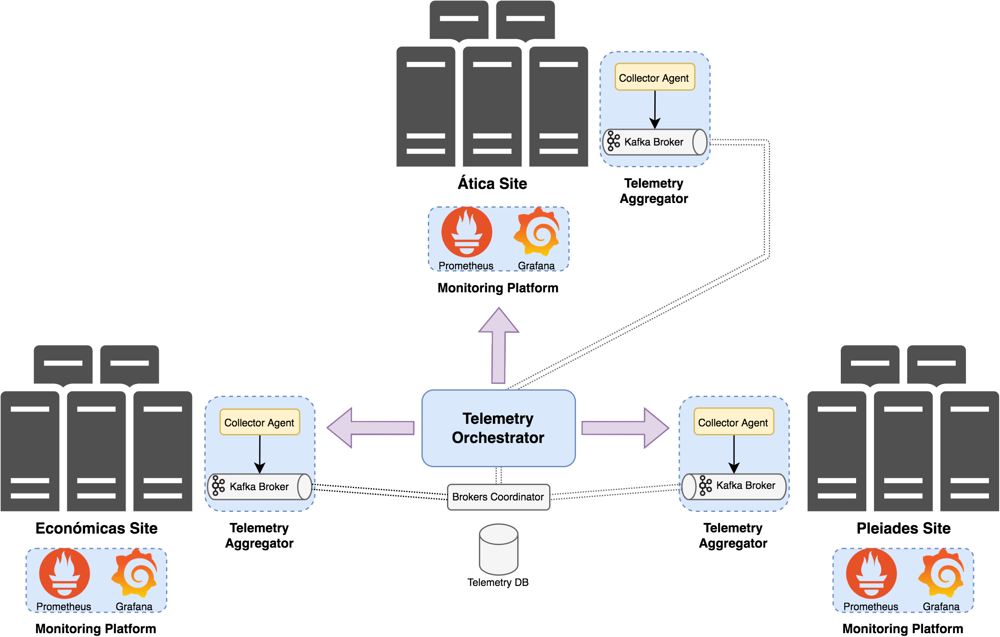

# pagoda-telemetry-orchestrator

En el ámbito del proyecto PAGODA (Plataforma Automática de GestiÓn DistribuidA), se ha diseñado un sistema para orquestar la recolección y agregación de datos de telemetría, denominado Orquestador de Telemetría, que permita obtener información de rendimiento de los servicios virtualizados desplegados en la infraestructura de red Edge Computing de PAGODA a través de la instanciación de plataformas de monitorización basadas en el stack de Prometheus. En la siguiente figura se muestra una representación a alto nivel de la arquitectura del sistema de orquestación de telemetría propuesto.

Como se puede observar en la figura siguiente, existe un componente central denominado Telemetry Orchestrator que se encarga de orquestar el proceso de recolección y agregación de datos de telemetría. Este componente tiene una API basada en REST y con especificación OpenAPI que permite al operador del sistema determinar qué información de telemetría desea recopilar, con qué frecuencia y a partir de qué sede concreta (es decir, Ática, Económicas o Pleiades) desea obtenerla. Una vez el operador indica la información de telemetría a monitorizar (en concreto, información de telemetría relativa a métricas proporcionadas desde la plataforma de monitorización Prometheus), el componente Telemetry Orchestrator guarda la información de la solicitud en una base de datos (Telemetry DB en la figura) y se activa y automatiza el proceso de recolección y agregación de datos de telemetría en la sede pertinente. Aquí es donde entra en juego el papel del componente Telemetry Aggregator de cada sede de la infraestructura de red de PAGODA. Este componente se encarga de gestionar el ciclo de vida del procedimiento de recolección y agregación de métricas de Prometheus. Tiene dos entidades básicas y fundamentales: Collector Agent y Kafka Broker. El Collector Agent está basado en una solución de Apache NiFi y es la entidad que se encarga de automatizar el proceso de recolección de datos de telemetría de Prometheus según el intervalo de muestreo indicado. Esta entidad permite además realizar un procesamiento adicional para limpieza y estructuración de los datos de telemetría que conlleva la normalización de los datos de telemetría según un modelo YANG definido para Prometheus. Este modelo YANG está influenciado por el modelo de datos que propone Prometheus para modelar las métricas y por la especificación propuesta por la iniciativa OpenMetrics. Para poder automatizar el proceso de estructuración de los datos de las métricas de Prometheus originales de acuerdo al modelo YANG propuesto se ha desarrollado un procesador en NiFi programado como una aplicación Java que que se encarga de implementar dicha funcionalidad, haciendo uso de la librería YANG Tools de OpenDayLight. Los datos de telemetría resultantes son enviados continuamente como datos de streaming a un bus de mensajes basado en una solución de Apache Kafka. La función del Kafka Broker es actuar como un substrato de datos de telemetría al que los consumidores interesados pueden suscribirse. Apache Kafka es dependiente de un servicio denominado Apache Zookeeper, pensado para la coordinación eficiente y escalable de sistemas distribuidos, que permite coordinar el intercambio de los datos entre brokers distribuidos. Precisamente esta es la función del componente Brokers Coordinator para poder coordinar el intercambio de datos de telemetría entre los Kafka Brokers existentes en cada sede. Finalmente, cada sede tiene instalada y configurada una plataforma de monitorización (es decir, Monitoring Platform en la figura) basada en el stack de Prometheus desde donde se obtiene la información de telemetría relativa a métricas de rendimiento de los servicios virtualizados desplegados en cada sede y a métricas de rendimiento general de la infraestructura de la propia sede.

