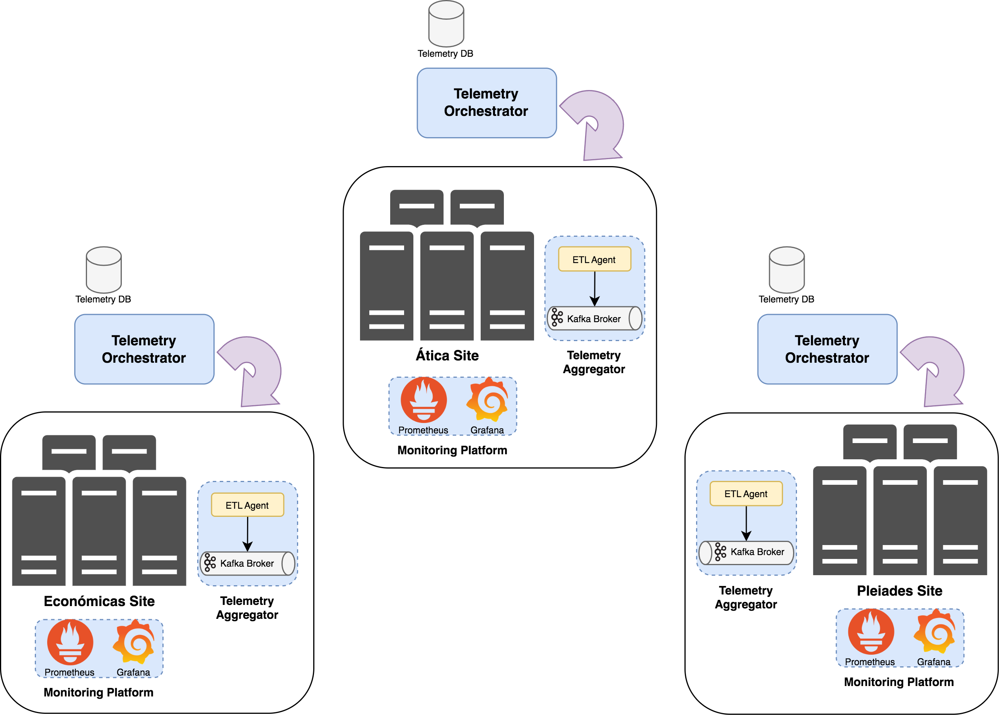

# Sistema de Orquestación de Telemetría de PAGODA

En el ámbito del proyecto `PAGODA` (_Plataforma Automática de GestiÓn DistribuidA_), se ha diseñado un sistema para orquestar la recolección y agregación de datos de telemetría, denominado Orquestador de Telemetría, que permita obtener información de rendimiento de los servicios virtualizados desplegados en la infraestructura de red _Edge Computing_ de `PAGODA` a través de la instanciación de plataformas de monitorización basadas en el stack de [Prometheus](https://Prometheus.io/). En la siguiente figura se muestra una representación a alto nivel de la arquitectura del sistema de orquestación de telemetría propuesto.



Como se puede observar en la figura, existe un componente central denominado `Telemetry Orchestrator` que se encarga de orquestar el proceso de recolección y agregación de datos de telemetría. Es un servicio particular de cada sede (es decir, _Ática_, _Económicas_ o _Pleiades_) Este componente tiene una API basada en REST y con [especificación OpenAPI](utils/openapi-spec/telemetry-api.json) que permite al operador del sistema determinar qué información de telemetría desea recopilar y con qué frecuencia  desea obtenerla. Una vez el operador indica la información de telemetría a monitorizar (en concreto, información de telemetría relativa a métricas proporcionadas desde la plataforma de monitorización Prometheus), el componente `Telemetry Orchestrator` guarda la información de la solicitud en una base de datos (_Telemetry DB_ en la figura) y se activa y automatiza el proceso de recolección y agregación de datos de telemetría en la sede pertinente. 

Aquí es donde entra en juego el papel del componente `Telemetry Aggregator` de cada sede de la infraestructura de red de `PAGODA`. Este componente se encarga de gestionar el ciclo de vida del procedimiento de recolección y agregación de métricas de Prometheus. Tiene dos entidades básicas y fundamentales: _ETL Agent_ y _Kafka Broker_. El _ETL_ Agent está basado en una solución de [Apache NiFi](https://nifi.apache.org/) y es la entidad que se encarga de automatizar el proceso de recolección de datos de telemetría de Prometheus según el intervalo de muestreo indicado. Esta entidad permite además realizar un procesamiento adicional para limpieza y estructuración de los datos de telemetría que conlleva la normalización de los datos de telemetría según un modelo [YANG](https://www.rfc-editor.org/rfc/rfc7950) definido para Prometheus (el modelo YANG se puede ver [aquí](docker/prometheus/yang-models/prometheus-pagoda.yang)). Este modelo YANG está influenciado por el [modelo de datos que propone Prometheus para modelar las métricas](https://github.com/OpenObservability/OpenMetrics/blob/main/specification/OpenMetrics.md) y por la especificación propuesta por la iniciativa [OpenMetrics](https://github.com/OpenObservability/OpenMetrics/blob/main/specification/OpenMetrics.md). Para poder automatizar el proceso de estructuración de los datos de las métricas de Prometheus originales de acuerdo al modelo YANG propuesto se ha desarrollado un procesador en NiFi programado como una aplicación Java que que se encarga de implementar dicha funcionalidad, haciendo uso de la librería [YANG Tools](https://docs.opendaylight.org/en/stable-sulfur/developer-guides/yang-tools.html) de OpenDayLight. Los datos de telemetría resultantes son enviados continuamente como datos de streaming a un bus de mensajes basado en una solución de [Apache Kafka](https://kafka.apache.org/) ([aquí](utils/prometheus-kafka-samples/yang-sample-iso8601/atica-node_network_transmit_packets_total-62f283db94774a15a79bb5aa.json) se representa una muestra ejemplo de una métrica resultante publicada en un _topic_ de un _broker_ de Kafka). La función del _Kafka Broker_ es actuar como un substrato de datos de telemetría al que los consumidores interesados pueden suscribirse. 

Finalmente, cada sede tiene instalada y configurada una plataforma de monitorización (es decir, `Monitoring Platform` en la figura) basada en el _stack_ de Prometheus desde donde se obtiene la información de telemetría relativa a métricas de rendimiento de los servicios virtualizados desplegados en cada sede y a métricas de rendimiento general de la infraestructura de la propia sede. 

Una de las funcionalidades adicionales del servicio `Telemetry Orchestrator` es la opción de permitir activar el seguimiento activo de la localización de los equipos de usuarios o UEs (_User Equipments_) de los clientes móviles dentro de la infraestructura de red 5G de `PAGODA` mediante el uso subordinado de la API basada en REST y con especificación OpenAPI que proporciona la solución `NDAC Manager` de Nokia. 

## Despliegue del prototipo del sistema de orquestación de telemetría

En este repositorio se encuentra un prototipo funcional del sistema de orquestación de telemetría basado en Docker. El despliegue del sistema de orquestación de telemetría está pensado para ser lanzado en 3 máquinas virtuales diferentes instanciadas sobre las plataformas OpenStack que hay disponibles en cada una de las sedes. La distribución de servicios por máquina virtual es la siguiente:

- En la primera máquina virtual se despliega el stack particular de Prometheus. Se configura el servicio de Prometheus para recoger información de métricas sobre el estado de máquinas virtuales desplegadas en la sede concreta y sobre el estado de los nodos de la infraestructura física de la propia sede. Además, los servidores de Prometheus son configurados con HTTPS y credenciales de autenticación, y se han generado certificados TLS para establecer conexiones seguras. Además, en esta máquina virtual se despliega también el servicio de Grafana donde representar y analizar gráficamente las diferentes métricas monitorizadas. Consideramos que el servicio de Prometheus ya está operativo en máquinas virtuales destinadas para ello en cada sede de PAGODA (`monitor-central`, `monitor-mec1` y `monitor-mec2`).

- En la segunda máquina virtual se despliegan la mayor parte de los servicios del sistema de orquestación de telemetría, contando con: la API del orquestador de telemetría y la base de datos mongoDB para guardar un registro de información sobre las métricas de Prometheus monitorizadas. Además, en esta máquina virtual también se despliega el servicio de Apache Kafka donde van a publicarse periódicamente los datos de telemetría monitorizados. Todos estos servicios son desplegados como microservicios Docker dentro de la máquina virtual. 

Para desplegar los servicios dependientes de esta máquina virtual, execute el siguiente comando:

```bash
$ docker-compose -f docker-compose-pagoda.yml up
```

En caso de que esté interesado en ejecutar el docker-compose en segundo plano (los registros o _logs_ de los diferentes microservicios pueden ser molestos), use el siguiente comando:
```bash
$ docker-compose -f docker-compose-pagoda.yml up -d
```

Para detener los servicios, ejecute lo siguiente:
```bash
$ docker-compose -f docker-compose-pagoda.yml down
```

- En la tercera máquina virtual se despliega el servicio de Apache NiFi para procesar las canalizaciones de datos de las métricas de Prometheus que sean monitorizadas. Este servicio también es desplegado como un microservicio Docker dentro de la máquina virtual. Inicialmente se consideró desplegar el servicio NiFi junto con el resto de servicios del sistema de orquestación de telemetría sobre la misma máquina virtual. Pero analizando las prestaciones de NiFi se comprobó que cuando se monitorizaban varias métricas de Prometheus al mismo tiempo la máquina virtual demandaba recursos de memoria RAM y de CPU elevados. Por ello, se decidió dedicar una única máquina virtual separada para el servicio de NiFi. Para el servicio de localización de usuarios, está pensado que sólo sea ejecutado desde el nodo central.

Para desplegar el servicio NiFi, execute el siguiente comando (está particularizado para el servicio NiFi del nodo central):
```bash
$ docker-compose -f docker-compose-nifi-central.yml up
```

En caso de que esté interesado en ejecutar el servicio de NiFi en segundo plano (los registros o _logs_ de los diferentes microservicios pueden ser molestos), use el siguiente comando:
```bash
$ docker-compose -f docker-compose-nifi-central.yml up -d
```

Para detener el servicio, ejecute lo siguiente:
```bash
docker-compose -f docker-compose-nifi-central.yml down
```

> **NOTA IMPORTANTE:**
>
> En el archivo `.env` se definen y parametrizan múltiples variables de entorno que toman los microservicios definidos en los diferentes docker-compose (p.ej., para definir el endpoint de la instancia de Prometheus, el endpoint del servicio NiFi o el endpoint del broker de Kafka). Por defecto, los variables de entorno están configuradas para el despliegue del sistema de orquestación de telemetria para el nodo central de PAGODA.

## Requisitos

- Docker (_probado con versión 20.10.14_)
- Docker-compose (_probado con la versión 1.27.4_)
- Python 3.9
- [Poetry](https://python-poetry.org/docs/)

## Manuales de usuario

Para conocer con detalle la utilidad de las diferentes operaciones proporcionadas por la API del servicio `Telemetry Orchestrator` para la gestión de la telemetría basada en Prometheus, consulta la información [aquí](docs/prometheus-telemetry-openapi-recipe/README.md).

Para conocer con detalle la utilidad de las diferentes operaciones proporcionadas por la API del servicio `Telemetry Orchestrator` para la localización de usuarios según la antena, consulta la información [aquí](docs/ue-location-openapi-recipe/README.md).

## Licencia

Este proyecto tiene licencia [Apache-2.0](https://www.apache.org/licenses/LICENSE-2.0).

