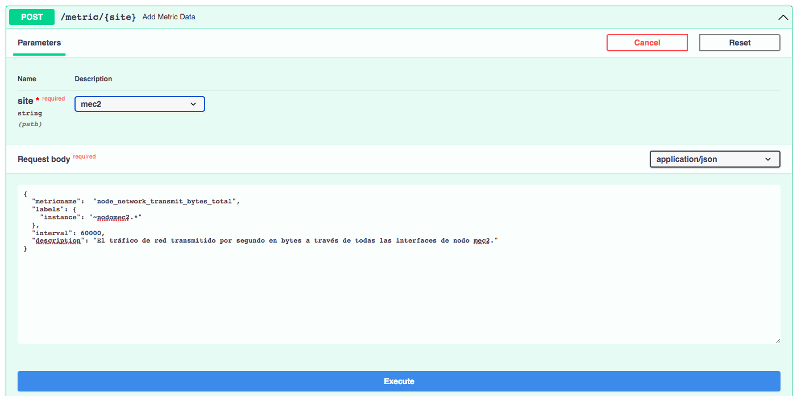
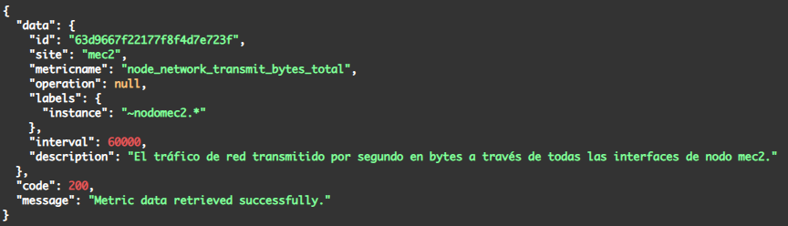
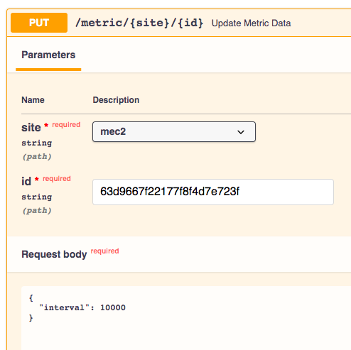

# API del servicio Telemetry Orchestrator para la gestión de datos de telemetría de Prometheus

El servicio `Telemetry Orchestrator` es el _frontend_ y el servicio principal del sistema de orquestación de telemetría de `PAGODA`. Se trata de un servicio central interoperable a través de una API REST con especificación OpenAPI programada en Python mediante la librería [FastAPI](https://fastapi.tiangolo.com/) que permite gestionar las operaciones CRUD (_Create, Read, Update and Delete_) para mantener la persistencia de los datos de telemetría de las plataformas de monitorización en la infraestructura de `PAGODA`.

Las operaciones CRUD de la API del servicio `Telemetry Orchestrator` para la gestión de la telemetría basada en Prometheus son las siguientes:

- `POST /metric/{site}/`: Esta operación permite definir la información de telemetría que se quiere recolectar y agregar. En concreto, permite definir información sobre una métrica de Prometheus de una sede de la infraestructura de PAGODA a monitorizar. La información de la métrica incluye: nombre, etiquetas y/o operaciones, intervalo de muestreo y descripción opcional. Una vez efectuada la operación, se almacenará la información descriptiva en una base de datos y se desencadenará la instanciación e iniciación de un proceso en el servicio _Collector Agent_ (es decir, en Apache NiFi) para permitir la recolección de datos de la métrica definida periódicamente y su agregación en un _topic_ del _broker_ de Kafka específico ([aquí](../../utils/prometheus-kafka-samples/yang-sample-iso8601/atica-node_network_transmit_packets_total-62f283db94774a15a79bb5aa.json) se representa una muestra ejemplo de una métrica resultante publicada en un _topic_ de un _broker_ de Kafka). En las siguientes figuras se muestran un ejemplo del cuerpo de la solicitud y un ejemplo de la respuesta en caso de éxito.

- `GET /metric/{site}/{id}`: Esta operación permite consultar los datos específicos de una de las métricas previamente registradas en el sistema de telemetría para una sede concreta. Para ello, entre la información de las métricas registradas en la base de datos con la operación POST, se incluye un identificador o ID unívoco que permite diferenciar las diferentes métricas registradas. El cuerpo de la respuesta en caso de éxito es un objeto JSON tal como muestra el ejemplo de la siguiente figura.

- `GET /metric/{site}/`: Esta operación permite consultar los datos de todas y cada una de las métricas previamente registradas en el sistema de telemetría para una sede concreta.

- `PUT /metric/{site}/{id}`: Esta operación permite actualizar los datos específicos de una de las métricas previamente registradas en el sistema de telemetría para una sede concreta. Mediante esta operación, haciendo uso del ID unívoco de una métrica previamente registrada, se puede editar cierta información como el intervalo de muestreo, sus etiquetas o la operación si la hubiera. Esta operación actualiza los datos descriptivos de la métrica en la base de datos y también desencadena la actualización de los parámetros de consulta de la métrica en el proceso resultante del servicio _Collector Agent_ (es decir, en Apache NiFi). Un ejemplo del cuerpo de la solicitud se muestra en la Ilustración 11, donde se desea actualizar el intervalo de muestreo y ciertas etiquetas de la métrica de Prometheus que ya está siendo monitorizada. En la figura sigueinte se muetra un ejemplo de la respuesta en caso de que la operación sea exitosa.

- `DELETE /metric/{site}/{id}`: Esta operación permite borrar una métrica previamente registrada en el sistema de telemetría para una sede concreta. Mediante esta operación, haciendo uso del ID unívoco de una métrica previamente registrada, se puede eliminar el registro de una métrica, así como su información relativa en la base de datos. Además, esto desencadena la desactivación y eliminación del proceso relativo al servicio _Collector Agent_ (es decir, en Apache NiFi) para así parar de recolectar y de almacenar los datos de telemetría de la métrica en cuestión. El ejemplo de cuerpo de la respuesta se muestra en la siguiente figura.

