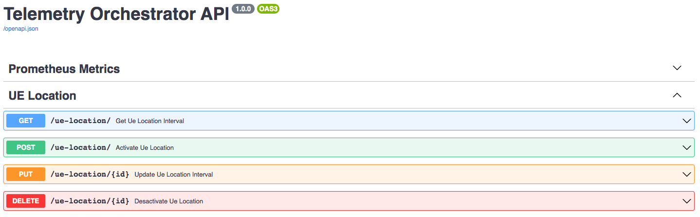
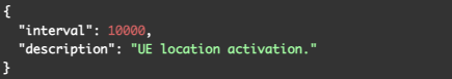
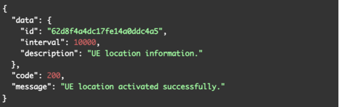
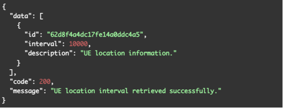

# API del servicio Telemetry Orchestrator para la localización de usuarios según la antena de la red móvil

Una de las funcionalidades adicionales del servicio `Telemetry Orchestrator` es la opción de permitir activar el seguimiento activo de la localización de los equipos de usuarios o UEs (_User Equipments_) de los clientes móviles según la antena de la red móvil dentro de la infraestructura de red 5G de `PAGODA` mediante el uso subordinado de la API basada en REST y con especificación OpenAPI que proporciona la solución `NDAC Manager` de Nokia. La API REST de `NDAC` permite obtener información sobre los equipos de usuarios que hay conectados a los puntos de acceso o antenas de la infraestructura de red 5G de `PAGODA`, como puede ser información de las SIMs de los equipos móviles subscriptos a los servicios de red 5G relativa a: identificadores únicos (como son el IMSI, IMEI o ICC ID), información descriptiva que identifica al equipo hardware de la antena en la que se encuentran registrados y por tanto conectados y localizados los UEs, así como marcas de tiempo o timestamps sobre la fecha y hora desde que un UE se registró en dicha antena.

A grandes rasgos, el servicio `Telemetry Orchestrator` según una frecuencia definida, realizará
solicitudes o queries periódicas a la API de `NDAC` para obtener la información sobre la localización de los usuarios y la irá publicando en un _topic_ en un bus o _broker_ de Kafka al que podrán subscribirse los consumidores interesados para recibir notificaciones sobre las actualizaciones de la localización de cada usuario. En el ámbito de `PAGODA`, la información de localización de usuarios se publicará en Kafka para notificar sobre la aparición de nuevos usuarios y para notificar del cambio de antena de alguno de los usuarios conectados a las antenas móviles. El `Orquestador Multi-Capa` (OMC) será la entidad encargada de recoger estas notificaciones sobre la localización de los UEs. La API REST del servicio `Telemetry Orchestrator` incluye la posibilidad de gestionar diferentes operaciones CRUD para poder habilitar o deshabilitar la localización activa de los usuarios móviles dentro de la infraestructura de `PAGODA`.

Las operaciones CRUD de la API del servicio `Telemetry Orchestrator` para la gestión de la localización de los UEs, representadas en la figura anterior, son las siguientes:

- `POST /ue-location/`: Esta operación permite activar la función de localización de usuarios. En concreto, permite definir un intervalo en milisegundos para realizar periódicamente diferentes consultas o queries a la API de `NDAC` que permiten obtener información precisa sobre los distintos UEs conectados a la red. Una vez efectuada la operación, se almacenará información sobre el intervalo de consulta en una base de datos (servicio _Telemetry DB_ del sistema de orquestación de telemetría) y se desencadenará la instanciación e iniciación de un proceso en el servicio _Collector Agent_ del sistema de orquestación de telemetría (es decir, en Apache NiFi) para permitir realizar periódicamente las consultas pertinentes a la API de `NDAC`, procesar, recoger y ordenar la información relativa a la localización de los diferentes UEs, y de agregar la información resultante en un _topic_ de un _broker_ de Kafka específico. Ejemplos del cuerpo de la solicitud y del cuerpo de la respuesta en caso de éxito se muestran en las siguientes figuras.

Como resultado, la activación de la recolección de información de localización de los usuarios produce como resultado la publicación periódica de esta información a través de Apache Kafka ([aquí](../../utils/ue-location-kafka-samples/icc-info-62da7e6ff982d9e22b48a6b1.json) puede verse una muestra de ejemplo de la información de localización de usuarios publicada un _topic_ de un _broker_ de Kafka). 

- `GET /ue-location/`: Esta operación permite obtener el intervalo de consulta periódica definido actualmente para la gestión de la localización de usuarios. El cuerpo de la respuesta en caso de éxito es un objeto JSON tal como muestra el ejemplo de la siguiente figura.

- `PUT /ue-location/{id}`: Esta operación permite definir un nuevo intervalo de consulta periódica para la gestión de la localización de usuarios. Para esta operación es necesario indicar, además del nuevo intervalo de consulta, el identificador o ID asignado en la base de datos a la activación de la localización de los UEs. Como resultado, esta operación actualiza el nuevo intervalo de consulta de la localización de los UEs en la base de datos y también desencadena la actualización de este intervalo de consulta en el proceso resultante del servicio _Collector Agent_ del sistema de orquestación de telemetría. Los ejemplos de cuerpo de solicitud y respuesta en caso de éxito son los mismos que para el `POST /ue-location`.

- `DELETE /ue-location/{id}`: Esta operación permite deshabilitar la función de localización de usuarios. Mediante esta operación, haciendo uso del ID asignado en la base de datos a la activación de la localización de los UEs, se puede deshabilitar el proceso de localización de UEs, así como la información relativa en la base de datos. Por tanto, esta operación desencadena la desactivación y eliminación del proceso relativo al servicio _Collector Agent_ (del sistema de orquestación de telemetría para así parar de realizar las consultas periódicas a la API de `NDAC` y dejar de almacenar los datos de localización de usuarios en el bus de Kafka. El ejemplo de cuerpo de la respuesta se muestra en la siguiente figura.

